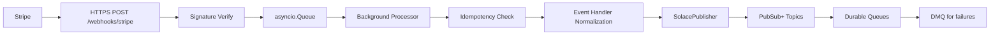

# stripe-solace-bridge

Production-grade async microservice that ingests Stripe webhook events and publishes normalized payloads into Solace PubSub+ with guaranteed delivery semantics, idempotency, observability, DMQ handling, and end-to-end validation tooling.

## Architecture



## Prerequisites

- Docker + Docker Compose
- Python 3.11+
- Stripe CLI
- GNU Make

## Quick Start

```bash
cp .env.example .env
make e2e
```

`make e2e` is cloud-default. For strict local Solace mode, use `make e2e-local`.

## Environment Variables

| Variable | Required | Description |
|---|---|---|
| `STRIPE_WEBHOOK_SECRET` | yes | Stripe webhook signing secret (`whsec_...`) |
| `STRIPE_API_KEY` | yes | Stripe API key for CLI/validation |
| `SOLACE_HOST` | yes | Solace messaging host (`tcp://...` or `wss://...`) |
| `SOLACE_SEMP_HOST` | yes for provisioning | SEMP base URL |
| `SOLACE_SEMP_USERNAME` | yes for provisioning | SEMP username |
| `SOLACE_SEMP_PASSWORD` | yes for provisioning | SEMP password |
| `SOLACE_VPN` | yes | Solace message VPN |
| `SOLACE_USERNAME` | yes | Solace client username |
| `SOLACE_PASSWORD` | yes | Solace client password |
| `SOLACE_TLS_ENABLED` | no | Enable TLS transport strategy |
| `SOLACE_TLS_CA_CERT_PATH` | no | Trust store path for TLS validation |
| `APP_PORT` | no | HTTP port (default `8080`) |
| `LOG_LEVEL` | no | Logging level (default `INFO`) |
| `IDEMPOTENCY_TTL_SECONDS` | no | Event dedup TTL (default `86400`) |
| `ASYNC_QUEUE_SIZE` | no | Async event queue capacity |
| `MAX_PUBLISH_RETRIES` | no | Solace publish retry attempts |
| `RETRY_BACKOFF_BASE_SECONDS` | no | Retry base backoff |
| `SOLACE_MESSAGE_TTL_MS` | no | Solace message TTL (`0` means infinite) |
| `DMQ_ELIGIBLE` | no | Enable DMQ eligibility |
| `ASYNC_SHUTDOWN_TIMEOUT_SECONDS` | no | Graceful worker drain timeout |
| `REDIS_URL` | yes | Redis connection URL |
| `E2E_STRIPE_ACCOUNT_ID` | yes for e2e | Stripe account id used in topic/account checks |
| `E2E_CONSUME_TIMEOUT_SECONDS` | no | E2E consume timeout |
| `E2E_QUEUE_DRAIN_BEFORE_TEST` | no | Drain queues before E2E tests |

## Topic Taxonomy

Topic format:

```
stripe/webhook/v1/{event_category}/{event_type_suffix}/{account_id}
```

| Stripe Event Type | Topic |
|---|---|
| `payment_intent.succeeded` | `stripe/webhook/v1/payment_intent/succeeded/{account_id}` |
| `payment_intent.payment_failed` | `stripe/webhook/v1/payment_intent/payment_failed/{account_id}` |
| `customer.subscription.created` | `stripe/webhook/v1/subscription/created/{account_id}` |
| `customer.subscription.updated` | `stripe/webhook/v1/subscription/updated/{account_id}` |
| `customer.subscription.deleted` | `stripe/webhook/v1/subscription/deleted/{account_id}` |
| `invoice.payment_succeeded` | `stripe/webhook/v1/invoice/payment_succeeded/{account_id}` |
| `invoice.payment_failed` | `stripe/webhook/v1/invoice/payment_failed/{account_id}` |
| `invoice.finalized` | `stripe/webhook/v1/invoice/finalized/{account_id}` |
| `charge.succeeded` | `stripe/webhook/v1/charge/succeeded/{account_id}` |
| `charge.failed` | `stripe/webhook/v1/charge/failed/{account_id}` |
| `charge.dispute.created` | `stripe/webhook/v1/charge/dispute/created/{account_id}` |
| `customer.created` | `stripe/webhook/v1/customer/created/{account_id}` |
| `customer.deleted` | `stripe/webhook/v1/customer/deleted/{account_id}` |
| `checkout.session.completed` | `stripe/webhook/v1/checkout/session/completed/{account_id}` |
| `payout.failed` | `stripe/webhook/v1/payout/failed/{account_id}` |
| unknown | `stripe/webhook/v1/error/unroutable/{account_id}` |

## Queue Inventory

| Queue Name | Subscribed Topic | Purpose |
|---|---|---|
| `stripe.payments.inbound` | `stripe/webhook/v1/payment_intent/>` | Payment intent downstream consumers |
| `stripe.subscriptions.inbound` | `stripe/webhook/v1/subscription/>` | Subscription lifecycle consumers |
| `stripe.invoices.inbound` | `stripe/webhook/v1/invoice/>` | Invoice consumers |
| `stripe.customers.inbound` | `stripe/webhook/v1/customer/>` | Customer data consumers |
| `stripe.all.inbound` | `stripe/webhook/v1/>` | Catch-all audit queue |
| `stripe.errors.dmq` | DMQ target | Dead-letter inspection queue |

## Make Targets

```bash
make install
make lint
make typecheck
make test-unit
make test-integration
make test-e2e
make up
make down
make provision
make validate
make e2e
make e2e-local
```

## Validation Script

```bash
python scripts/validate_pipeline.py \
  --app-url http://localhost:8080 \
  --stripe-key sk_test_xxx \
  --webhook-secret whsec_xxx \
  --solace-host tcp://localhost:55555 \
  --solace-vpn default \
  --solace-user stripe-bridge-user \
  --solace-password xxx \
  --account-id acct_xxx
```

## consume_queue Usage

```bash
python scripts/consume_queue.py --queue stripe.payments.inbound --count 10 --timeout 30 --pretty
python scripts/consume_queue.py --queue stripe.all.inbound --count 5 --ack
```

## Helm Deployment

```bash
helm upgrade --install stripe-solace-bridge ./helm/stripe-solace-bridge \
  --set image.repository=<repo> \
  --set image.tag=<tag>
```

Key values exposed in `helm/stripe-solace-bridge/values.yaml`:

- `replicaCount`
- `image.repository`, `image.tag`
- `config.stripe.webhookSecretRef`
- `config.solace.host`, `config.solace.vpn`, `config.solace.usernameRef`, `config.solace.passwordRef`
- `config.redis.enabled`, `config.redis.host`
- `resources.requests`, `resources.limits`
- `autoscaling.enabled`, `autoscaling.minReplicas`, `autoscaling.maxReplicas`, `autoscaling.targetCPU`
- `ingress.enabled`, `ingress.host`, `ingress.tls`
- `initJob.enabled`

## Troubleshooting

- Solace connection failures:
  - Verify `SOLACE_HOST`, `SOLACE_VPN`, credentials, and firewall/port access.
  - Check `/ready` and `solace_connection_status` metric.
- Stripe signature mismatch:
  - Confirm `STRIPE_WEBHOOK_SECRET` matches current `stripe listen` session secret.
- Queue backlog:
  - Inspect `async_queue_size` and queue depth in Solace manager.
- DMQ inspection:
  - Use `python scripts/consume_queue.py --queue stripe.errors.dmq --pretty --ack`.
- Metrics discrepancies:
  - Compare `/metrics` baseline and post-run counters during validation.
